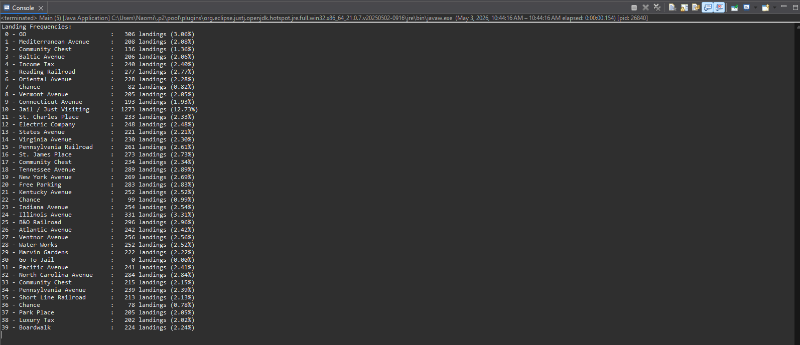

# CSIS 2430 — Project 4 Test Results
## Monopoly Simulation

---

## Test Summary

Testing for this project was completed incrementally as each feature was implemented. The goal of testing was to confirm that the Monopoly simulation correctly handles movement, dice rolls, doubles rules, jail behavior, Chance and Community Chest cards, landing counts, and final output formatting.

---

## Current Test Status

| Test Area | Status | Notes |
|----------|--------|-------|
| Program compiles | Completed | Program compiled successfully in Eclipse |
| Main simulation runs | Completed | Simulation executed from Main.java without errors |
| Dice rolling | Completed | Rolls produce valid values between 2 and 12 |
| Player movement | Completed | Player moves correctly across all 40 spaces |
| Board wrapping | Completed | Movement correctly wraps using modulo logic |
| Doubles detection | Completed | Doubles are detected and handled correctly |
| Three doubles rule | Completed | Player is sent to jail after three consecutive doubles |
| Go To Jail space | Completed | Landing on space 30 sends player to Jail |
| Jail behavior | Completed | Player exits jail via doubles or after 3 turns |
| Chance cards | Completed | Movement-based Chance cards function correctly |
| Community Chest cards | Completed | Movement-based Community Chest cards function correctly |
| Landing counts | Completed | Landing counts recorded for all 40 spaces |
| Output formatting | Completed | Output displays index, name, count, and percentage |

---

## Expected Run Command

javac src/*.java  
java -cp src Main

---

## Actual Output (Sample)

Landing Frequencies:  
 0 - GO                        :   306 landings (3.06%)  
 1 - Mediterranean Avenue      :   208 landings (2.08%)  
 10 - Jail / Just Visiting     :  1273 landings (12.73%)  
 24 - Illinois Avenue          :   331 landings (3.31%)  
 30 - Go To Jail               :     0 landings (0.00%)  

---

## Full Output Screenshot

---

## Verification Notes

- The simulation completed successfully without crashing  
- Output included all 40 Monopoly board spaces  
- Landing percentages summed to approximately 100%  
- Jail / Just Visiting had the highest landing frequency, which is expected due to multiple ways of being sent there  
- Spaces following jail (such as Illinois Avenue) appeared more frequently, matching expected Monopoly behavior  
- Chance and Community Chest spaces showed lower final counts since some cards move the player again  

---

## Issues Found

No major issues were found during testing. The simulation ran successfully and produced consistent results across multiple runs. Minor variations in landing counts are expected due to randomness.

---

## Final Testing Notes

The simulation behaves as expected and produces realistic landing distributions. The results align with known Monopoly probability patterns, confirming that the implementation is functioning correctly.
